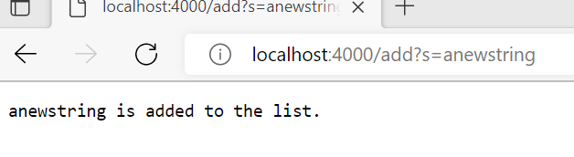
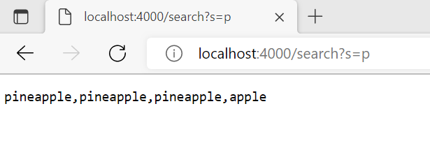
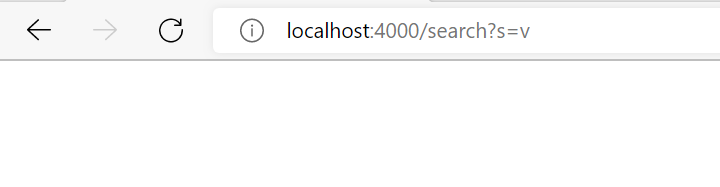

# Part 1
```

    import java.net.URI;
	import java.util.*;
	import java.io.IOException;
	
	class Handler implements URLHandler {
		// The one bit of state on the server: a number that will be manipulated by
		// various requests.
		List<String> list=new  ArrayList<String>();
	
	
		public String handleRequest(URI url) {
			System.out.println(url);
			if (url.getPath().equals("/")) {
				
				return String.format("Current List is %s", String.join(",", list));
					
			}else if (url.getPath().equals("/add")) {
					String[] parameters = url.getQuery().split("=");
					if (parameters[0].equals("s")) {
						list.add(parameters[1]);
						return String.format(" %s is added to the list.", parameters[1]);
					}
			}  else {
				System.out.println("Path: " + url.getPath());
				if (url.getPath().contains("/search")) {
					String[] parameters = url.getQuery().split("=");
					if (parameters[0].equals("s")) {
					List<String> filteredlist=new  ArrayList<String>();
					for (String s: list){
						
						if(s.contains(parameters[1])){
							filteredlist.add(s);
						}
					}
	
						return String.format(String.join(",", filteredlist));
					}
				}
			
			}
					return "404 Not Found!"; 
		}
	}
	
	class SearchEngine {
		public static void main(String[] args) throws IOException {
			if(args.length == 0){
				System.out.println("Missing port number! Try any number between 1024 to 49151");
				return;
			}
	
			if(args[0].equals("22")){
				System.out.println("Did you know that port 22 is the one used by ssh? We can't use it for a web server.");
				return;
			}
	
			int port = Integer.parseInt(args[0]);
	
			Server.start(port, new Handler());
		}
	}

```

### Adding a new String

This will call the handleRequest method and with the parameter as url path as /add and url query as s=anewstring


### Searching keyword which exists


This will call the handleRequest method and with the parameter as url path as /search and url query as s=p

### Searching Keyword which does not exists


This will call the handleRequest method and with the parameter as url path as /search and url query as s=v


#


# Part 2

## Problem 3

 1. ### Failure Inducing Input
    

 2. ### The Symptom(the failing test output)
    

 3. ### The Bug(the code fix needed)
    

Explanation: 
>  In the Symptom, we see the error was differed at position [0], which was expecting  <[a]> but found <[d]> for the ArrayList input as ["a","b","c","d"]. This is happening because the buggy code is always adding the string in to the new list at position 0. So it will not be in the same order in which order the strings are in orignal list.

Fix:
> To fix this issue, Either we will just add the string without providing the index, or we can keep increasing the index everytime.


## Problem 2

 1. ### Failure Inducing Input
    

 2. ### The Symptom(the failing test output)
    

 3. ### The Bug(the code fix needed)
    

Explanation: 
>  In the Symptom, we see the error was differed at position [0], which was expecting  <7> but found <0> for the array input as [3.4.5.6.7]. This is happening because in code, we are creating a new array of the same size as orignal array and then we are assiging the value from new array to the orignal array and returning the orignal array. This way we will loose all the values from orignal array.

Fix:
> To fix this issue, we will assign the values from orignal array to the new array in revesed order. And then we will return the new array.


## Problem 1

 1. ### Failure Inducing Input
    

 2. ### The Symptom(the failing test output)
    

 3. ### The Bug(the code fix needed)
    

Explanation: 
>  In the Symptom, we see the error was differed at position [3], which was expecting  4 but found 6 for the array input as [3.4.5.6.7]. This is happening because in code, we are changing the positions of numbers in array with its counter position in second half to make it reverse. But the problem will occure when we reach the half of array as we loose the array values of first half.

Fix:
> To fix this issue, we will store the array value in a tempprary variable and when we change first number with last number, we will change the last number also at the same time and then we can limit the for loop to half the lenth of an array.


