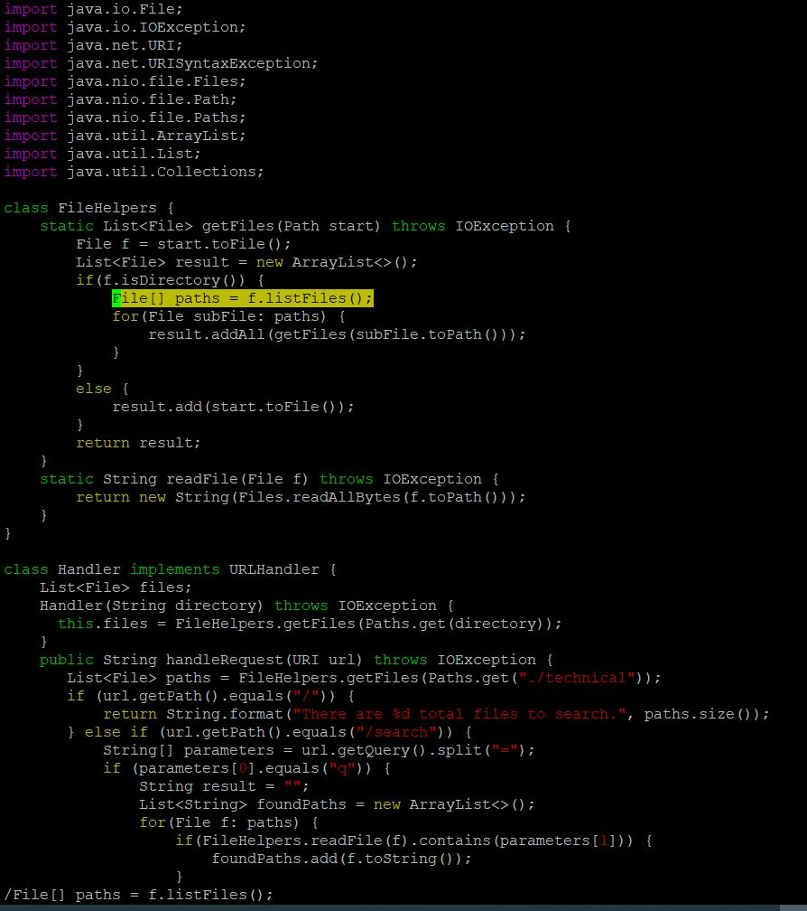

# WEEK 7 LAB REPORT 
#
# PART1

## Adding a new line to print before File[] paths = f.listfiles()

#

### Opening the File in VIM
`vim DocSearchServer.java<ENTER>` 

### Search for line File[] paths = f.listFiles();
`Type /File[] paths = f.listFiles();<ENTER>`

### Insert New line 
 `O` Capital O will insert the new line before the current line.

### Write Print statement
`System.out.println(f.toString+"is a directory");` 

### Save and Exit
`<ESC>:wq<ENTER>`

#

# PART2

## Two Potenital strategies

1. Start in Visual Studio Code and make the edit there, then scp the file to the remote server and run it to confirm it works (you can run bash test.sh on the remote to test it out). Consider having the appropriate scp command in your command history or have it easily copy-pasteable!
2. Make sure you are already logged into a remote computer after having correctly scp'd the file. Make the edit for the task you chose in Vim. Exit Vim and run bash test.sh.

#
### Time to edit file in Visual Studio Code ~10 seconds.
### Time to edit file in VIM editor ~15 seconds

With the first strategy, there is an additional time of copying the file to remote via scp.

#

### Lets use the first strategy :
	1. Visual Studio code is more user firendly than VIM editor
	2. Less chances of error.
	3. copy paste is easy in visual studio code.

#

### If we have to work on multiple files or projects where the file size is big and there are minimal edits , I would use the second strategy since there will be overhead of copying files to remote when using the first strategy. If there are more edits, then I will use the first strategy in any case.

