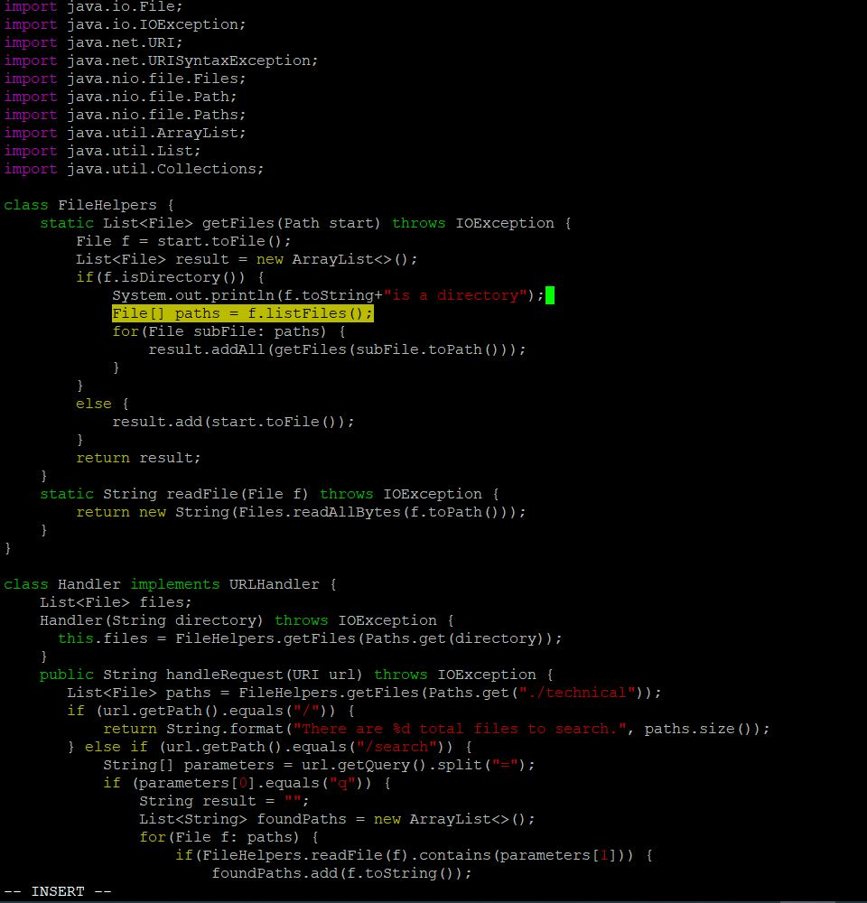

# WEEK 7 LAB REPORT 
#
# PART1

## Adding a new line to print before File[] paths = f.listfiles()

#

### Opening the File in VIM
`vim DocSearchServer.java<ENTER>` 

### Search for line File[] paths = f.listFiles();
`Type /File[] paths = f.listFiles();<ENTER>`

### Insert New line 
 `O` Capital O will insert the new line before the current line.

### Write Print statement
`System.out.println(f.toString+"is a directory");` 

### Save and Exit
`<ESC>:wq<ENTER>`

#

# PART2

## Two Potenital strategies

1. Once, start in Visual Studio Code and make the edit there, then scp the file to the remote server and run it there to confirm it works (you can just run bash test.sh on the remote to test it out). Consider having the appropriate scp command in your command history or easily copy-pasteable!
2. Second, start already logged into a ssh session. Then, make the edit for the task you chose in Vim, then exit Vim and run bash test.sh.

#
### Time to edit file in Visual Studio Code ~10 seconds.
### Time to edit file in VIM editor ~15 seconds

But in strategy 1 there is an additional time of copying the file to remote via scp.

#

### I will prefer the strategy-1 :
	1. Visual Studio code is more user firendly than VIM editor
	2. Less chances of error.
	3. copy paste is easy in visual studio code.

#

### I will choose strategy-1 but if we have to work on multiple files or project where the file size is big and there are minimal edits then i would choose strategy-2 as in strategy-1 there will be overhead of copying files to remote. If there are more edits then i will choose strategy-1 in any case.

