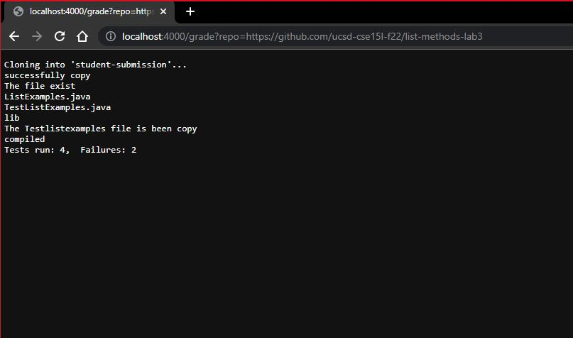
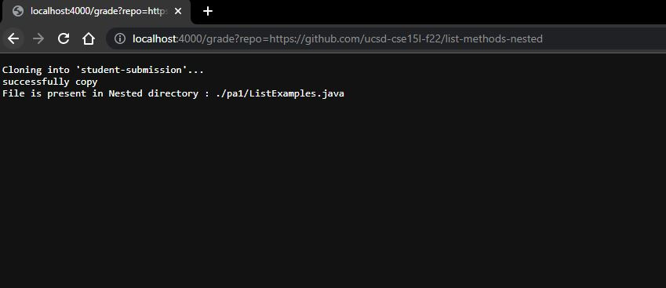
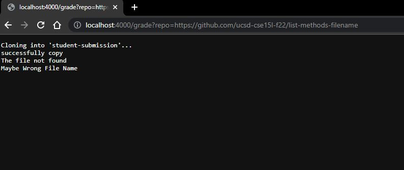
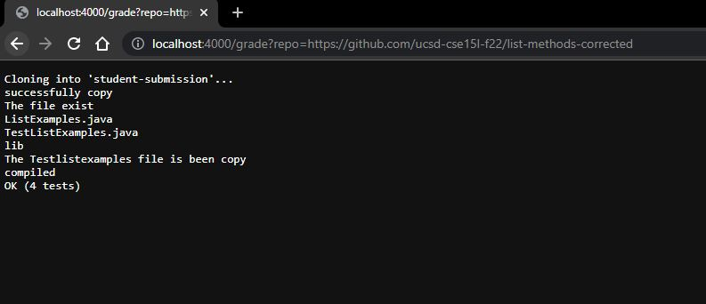

# LAB REPORT 5 - Lab #7
#
# Automatic Grader

## grade.sh

```
# Create your grading script here
set -e
rm -rf student-submission
git clone $1 student-submission

echo "successfully copy"
cd student-submission

if [[ -e ListExamples.java ]]
then
    echo "The file exist"
elif [[ -n $(find . -name ListExamples.java) ]]
then
    echo "File is present in Nested directory : "$(find . -name ListExamples.java)
    exit 1
else
    echo "The file not found"
    echo "Maybe Wrong File Name"
    exit 1
fi


cd ../
cp -rf lib student-submission
cp -f TestListExamples.java student-submission

cd student-submission

ls 
if [[ -e TestListExamples.java ]]
then
   echo "The Testlistexamples file is been copy"
else
   echo "The Testlistexamples file is not been copy"
   exit 1
fi

cpath=".:lib/hamcrest-core-1.3.jar:lib/junit-4.13.2.jar"

set +e
javac -cp $cpath *.java


if [[ $? -eq 0 ]]
then
  echo "compiled"
else
  echo "didn't compiled"
  exit 1
fi

java -cp $cpath org.junit.runner.JUnitCore TestListExamples > out.txt

if [[ $? -eq 0 ]]
then
  grep "OK" out.txt
  exit 0
else
  grep "Tests run:" out.txt
  exit 1
fi
```

# 

## Execution

### 1 https://github.com/ucsd-cse15l-f22/list-methods-lab3, which has the same code as the starter from lab 3


### 2 https://github.com/ucsd-cse15l-f22/list-methods-nested, which has a great implementation saved in a nested directory called pa1.


### 3 https://github.com/ucsd-cse15l-f22/list-methods-filename, which has a great implementation saved in a file with the wrong name.


### 4 https://github.com/ucsd-cse15l-f22/list-methods-corrected, which has the methods corrected (I would expect this to get full or near-to-full credit)


#

## Explanation: 
https://github.com/ucsd-cse15l-f22/list-methods-nested, which has a great implementation saved in a nested directory called pa1.

* Clone Repo
	- git clone $1 student-submission
* Check File Exist
	- if [[ -e ListExamples.java ]]
	- it reutn True if file exist else False.
	- In our example it will go to else block as file does not exist in current folder.
* Check For nested directory.
	- 
	- This will fid the file in nested directory and return the file path in print.
